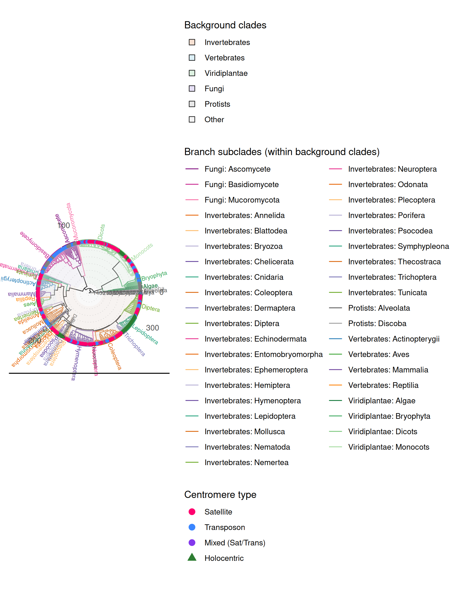

# 01 — Species tree & time calibration

A 325-species eukaryotic tree, time-calibrated with 62 secondary (TimeTree) constraints.

## Provided data (`data/`)
| file | what it is |
|---|---|
| `fast_species_tree_325sp_renamed.nwk` | **uncalibrated** ML species tree (FastSpeciesTree → IQ-TREE), tip-renamed |
| `full_325sp_calibrated_correlatedlambda01.nwk` | **calibrated** chronogram (final; correlated rates, λ = 0.1) |
| `calibration_points_62_timetree.tsv` | the 62 calibration nodes with TimeTree median / range / source (PAReTT-retrieved) |
| `over_calib_62.tsv` | the same 62 constraints as `chronos` input (`label, tip_a, tip_b, age_min, age_max`) |

## Steps (order · input → script → output)

1. **Species tree** *(external, not re-run here)* — proteomes → **FastSpeciesTree**
   (DIAMOND-anchored BUSCO pseudo-alignment) → partitioned IQ-TREE.
   → `data/fast_species_tree_325sp_renamed.nwk`.

2. **Retrieve TimeTree constraints** — `fetch_timetree_ci.py`
   in: species list · out: `calibration_nodes_timetree.tsv` (TimeTree CIs via PAReTT).

3. **Build the constraint table** — `make_calibration_table_64_325sp.R`
   in: the retrieved TimeTree CIs · out: the 62-node constraint table (`over_calib_62.tsv`).
   *(2 uncitable literature nodes were dropped from an earlier 64-node set, leaving 62.)*

4. **Time-calibrate** — `calibrate_chronos_correlated_325sp.R`
   in: uncalibrated tree + `over_calib_62.tsv` · out: the calibrated chronogram.
   ```bash
   Rscript calibrate_chronos_correlated_325sp.R over_calib_62.tsv \
     full_325sp_calibrated_correlatedlambda01.nwk correlated 0.1
   ```

5. **Model selection figure** — `plot_calibration_combined_benchmark_publication_325sp.R`
   in: node-age tables · out: the benchmark panel (correlated/relaxed/discrete × λ = 0, 0.1, 1, 10
   scored against TimeTree by MRCA node-age concordance). **Correlated λ = 0.1** wins and is used everywhere downstream.


