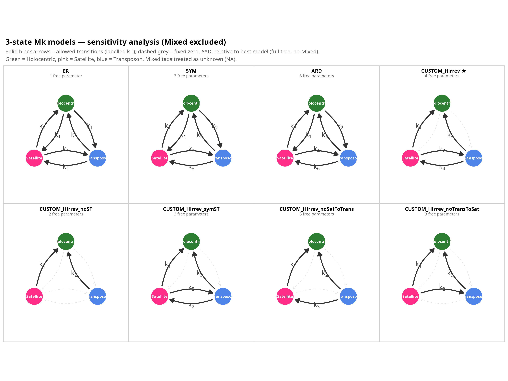

# 02 — Centromere-architecture ancestral-state reconstruction

Markov (Mk) models of centromere-architecture evolution on the calibrated 325-species tree,
testing the **α–ω cyclical hypothesis** (that centromere state cycles between satellite-based [α]
and transposon-based [ω] architectures). Uses `phytools`.

States: **H** (holocentric), **Sat** (satellite / α), **Trans** (transposon / ω),
**Mixed** (satellite + transposon on different chromosomes).

## Steps (order · input → script → output)

1. **Prepare inputs** — `00_prepare_inputs.R`
   in: calibrated tree (module 01) + per-species architecture annotation ·
   out: `inputs/<dataset>/tree_renamed.nw` + `branch_symbol_anno.tsv` for the full tree and the
   Metazoa / Viridiplantae sub-trees.

2. **Model definitions** — `02_custom_models.R`
   design matrices, including `ARD_irrevH` (H an irreversible sink; direct Sat↔Trans allowed).

3. **Fit & stochastic-map** — `37_test_cyclical_ARD_irrevH.R`
   in: a dataset's tree + states · out: fitted Mk models, LRT (cyclical vs terminal-transposon),
   and cached stochastic maps in `outputs/cyclical_ARD_irrevH/cache/`.

4. **Reversals** — `38_find_reversals.R` → detect X→Y→X state reversals on the mapped histories.

5. **Independent cycles** — `39_independent_cycles.R` → collapse reversals sharing an entry node
   into independent cycle events.

6. **Model comparison** — `40b_all_models_3state.R`
   fits the **seven** models compared in the paper and writes the AICc table
   (`outputs/all_models_3state/all_models_3state_aicc.tsv`):
   `ER`, `SYM`, `ARD`, `ARD_irrevH`, and three constrained variants
   (`ARD_irrevH_noDirectST`, `ARD_irrevH_noSatToTrans`, `ARD_irrevH_noTransToSat`).
   (`40_all_models_table.R` is the earlier 4-state/5-model version, retained for reference.)

7. **Trees with ASR** — `43_cycles_tree_mk_parsimony.R`
   ancestral states (marginal Mk + Fitch parsimony), cycles annotated on the tree.

`run_pipeline.sh` runs the sequence end-to-end.

## Key output
The 7-model comparison favours **`ARD_irrevH`**; the fitted transitions and inferred
independent cycles support the α–ω hypothesis.

