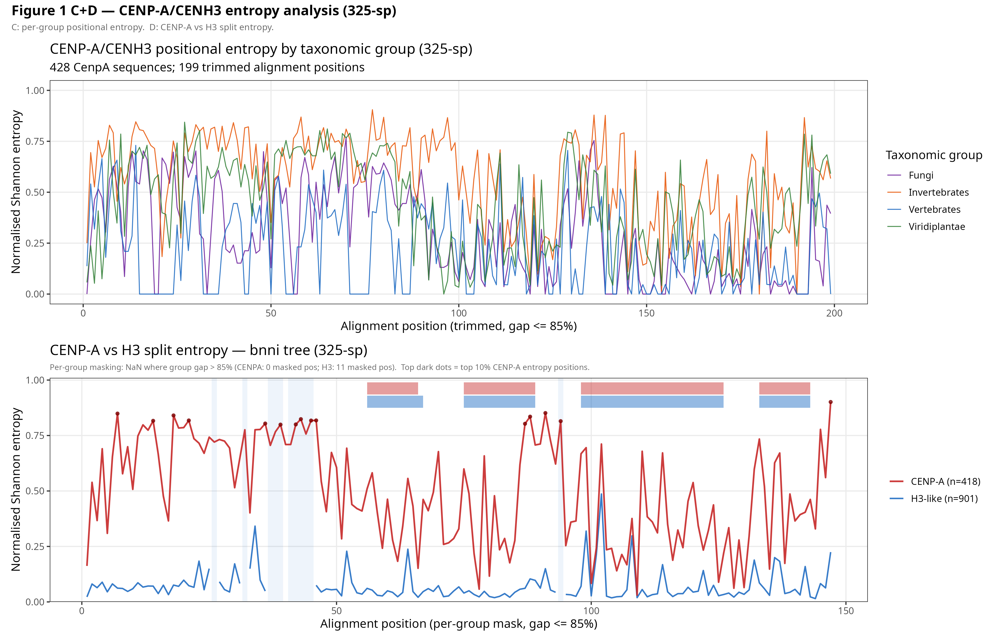
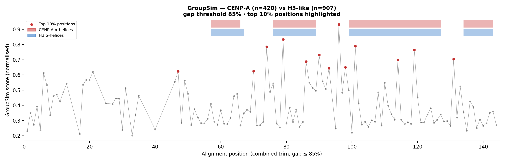

# 03 — CENP-A/CENH3 conservation & specificity

Two views of how the centromeric histone CENP-A/CENH3 differs from canonical histone H3
across the 325 species. The curated alignment splits into **422 CENP-A/CENH3** and
**897 H3-like** sequences (plus 10 archaeal outgroups = 1,329 total).

## Steps (order · input → script → output)

### Conservation entropy — via [entropia-msa](https://github.com/jacgonisa/entropia-msa)
1. `split_entropy_325sp.py`
   in: the CENP-A/CENH3 + H3 alignment (422 vs 897) · out: per-column split-entropy tables
   (`split_entropy_bnni_gap085.tsv`) + STRIDE α-helix positions.
2. `plot_entropy_325sp.R` → positional-entropy profile with α-helix bands (panel C).
3. `plot_panel_D_nomasking_325sp.py` → the split-entropy panel D (no-masking, filled version).

### GroupSim specificity-determining positions (SDPs) — via [groupsim-py3](https://github.com/jacgonisa/groupsim-py3)
4. `run_groupsim_325sp.py`
   in: the 422/897 alignment + curated group file · out: unweighted GroupSim scores per column
   (window = 3, λ = 0.7, gaps as a 21st character, scores in [0,1]; columns trimmed at >85 % gaps).
   Comparisons: CENP-A vs H3, and satellite- vs transposon-state CENP-A.
5. `run_groupsim_cenpa_h3_clade_325sp.py`
   clade-weighted variant (each sequence weighted 1/n_clade over broad taxonomic groups; mean 1
   per group) controlling for uneven sampling. **Significant SDPs = clade-weighted z ≥ 2.**
6. `plot_groupsim_cenpa_h3_gap085.R` → publication GroupSim figure (unweighted + weighted tracks)
   with the CENP-A helix track.

## Key output
The positional-entropy profile and the set of significant SDPs distinguishing CENP-A/CENH3
from H3 — concentrated in the histone-fold loop-1/α2 CENP-A targeting domain.

