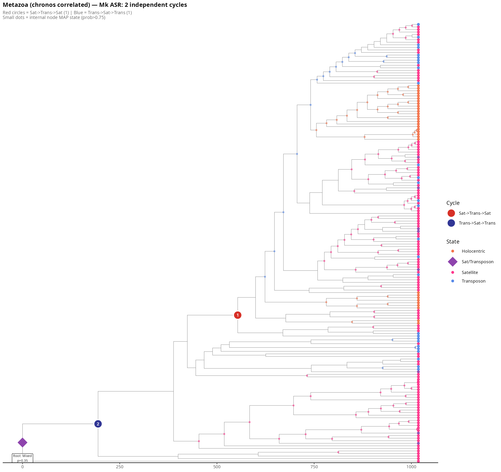
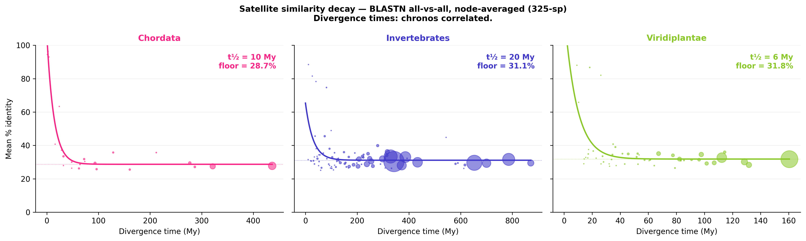

# DToL centromere phylogenomics

Core analyses for the Darwin Tree of Life centromere-evolution study (325 species): a
time-calibrated species tree and, on it, centromere-architecture evolution, CENP-A/CENH3
conservation, and satellite-DNA similarity decay.

Only the essential scripts are kept here. The full analysis repository, with every figure
and intermediate table, is at https://github.com/jacgonisa/DToL_phylogenomics

External tools (not included): FastSpeciesTree; groupsim-py3
(https://github.com/jacgonisa/groupsim-py3); entropia-msa
(https://github.com/jacgonisa/entropia-msa). Scripts keep their original file paths —
edit the paths at the top of each to run.

## 01 — Species tree & calibration

325-species tree from FastSpeciesTree, time-calibrated with `ape::chronos`
(correlated rates, λ = 0.1) using 62 TimeTree constraints.
Run: `fetch_timetree_ci.py` → `make_calibration_table_64_325sp.R` →
`calibrate_chronos_correlated_325sp.R`. Model choice is benchmarked against TimeTree in
`plot_calibration_combined_benchmark_publication_325sp.R`.

## 02 — Architecture ancestral-state reconstruction

Mk models of centromere-architecture evolution (satellite, transposon, mixed, holocentric)
across the tree, testing whether states cycle between satellite- and transposon-based
centromeres (the α–ω hypothesis). Uses `phytools`. Run `bash run_pipeline.sh`.

## 03 — CENP-A/CENH3 conservation

How the centromeric histone CENP-A/CENH3 differs from canonical H3: per-column entropy
(`split_entropy_325sp.py`, via entropia-msa) and GroupSim specificity-determining
positions (`run_groupsim_325sp.py` and the clade-weighted
`run_groupsim_cenpa_h3_clade_325sp.py`, via groupsim-py3).

## 04 — Satellite similarity decay

Satellite sequence similarity against species divergence time, and its half-life.
Run: `regen_sampled_1000.py` (sample monomers) → `seqsim_blastn_melters_325sp.py`
(all-vs-all BLASTN) → `halflife_chronos_correlated_325sp.py` (fit).

